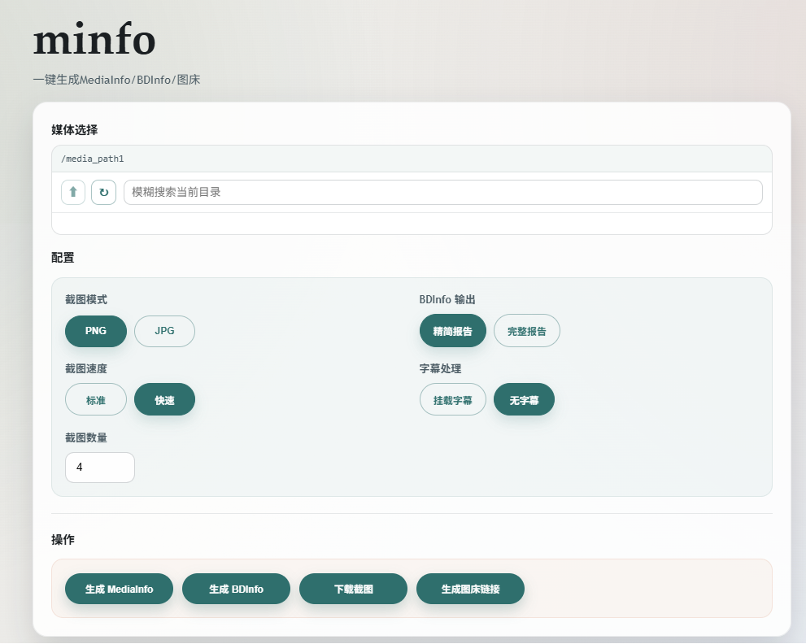

# minfo

`minfo` 是一个面向本地媒体资源的 Web 工具，支持生成 `MediaInfo`、`BDInfo`，以及截图和上传图床。



## 支持功能

- 输出 `MediaInfo` 信息
- 输出 `BDInfo` 信息，支持精简报告和完整报告，底层使用 [tetrahydroc/BDInfoCLI](https://github.com/tetrahydroc/BDInfoCLI)
- 生成截图并打包为 ZIP 下载
- 生成截图后上传到 `Pixhost`
- 截图支持 `PNG` / `JPG`
- 截图数量支持 `1` 到 `10` 张
- 截图支持字幕自动选择或关闭字幕
- 支持外挂字幕、内封文字字幕、内封位图字幕
- 支持 ISO 挂载与 `ISO:/path/to/file.iso!/inner/path` 虚拟路径

## 支持输入

- 普通视频文件
- 蓝光目录、`BDMV` 目录、`STREAM` 目录
- DVD 目录、`VIDEO_TS` 目录、`IFO` / `BUP` / `VOB` 文件
- 普通 ISO 文件
- 蓝光 ISO、DVD ISO
- ISO 内部虚拟路径

## 部署方式

直接使用已发布镜像 `ghcr.io/mirrorb/minfo:latest`。

示例 `docker-compose.yml`：

```yaml
services:
  minfo:
    image: ghcr.io/mirrorb/minfo:latest
    container_name: minfo
    privileged: true
    ports:
      - "28080:28080"
    environment:
      PORT: "28080"
      REQUEST_TIMEOUT: "20m"
    volumes:
      - /lib/modules:/lib/modules:ro # 用于挂载 ISO，保持默认
      - /your/media/path1:/media_path1:ro
      - /your/media/path2:/media_path2:ro
    restart: unless-stopped
```

启动：

```bash
docker compose up -d
```

## 运行要求

- 需要以 `privileged: true` 运行容器，以便挂载 ISO 和处理相关系统能力
- 若需要挂载 ISO，请保留 `/lib/modules:/lib/modules:ro`
- 建议将媒体目录只读挂载进容器


## 配置项

- `PORT`：Web 服务监听端口，默认 `28080`
- `REQUEST_TIMEOUT`：单次请求超时时间，默认 `20m`
- `SCREENSHOT_NCONVERT_ENABLED`：是否在 x86 / x86_64 平台的 PNG 截图后尝试调用 `nconvert` 二次压缩，默认 `true`
- `SCREENSHOT_NCONVERT_LEVEL`：`nconvert -clevel` 压缩级别，范围 `0-9`，默认 `6`
- `SCREENSHOT_PNG_COMPRESS_ENABLED`：是否启用 PNG 二次压缩总开关，默认 `true`
- `SCREENSHOT_PNGQUANT_QUALITY_MIN`：ARM 平台调用 `pngquant` 时的最小质量，默认 `65`
- `SCREENSHOT_PNGQUANT_QUALITY_MAX`：ARM 平台调用 `pngquant` 时的最大质量，默认 `90`

## 截图策略调整

- 默认不挂载字幕（除非后续明确启用）
- 截图时间点按影片时长使用固定步长生成
- 单张 PNG 截图只有在 **大于 10MB** 时才会触发压缩
- **x86 / x86_64**：优先使用内置 `nconvert`
- **ARM / ARM64**：使用 `pngquant`

## nconvert 集成

本仓库支持把 `nconvert` 作为可选第三方二进制一并打包，用于对 PNG 截图做额外压缩。

放置路径：

```text
third_party/nconvert/nconvert
```

安装方式：

```bash
sh scripts/install-nconvert.sh
```

Docker 构建时若检测到 `third_party/nconvert/nconvert` 存在，且目标架构为 `amd64`，会自动安装到：

```text
/usr/local/bin/nconvert
```

## 许可证

本项目采用 [MIT License](LICENSE)。
